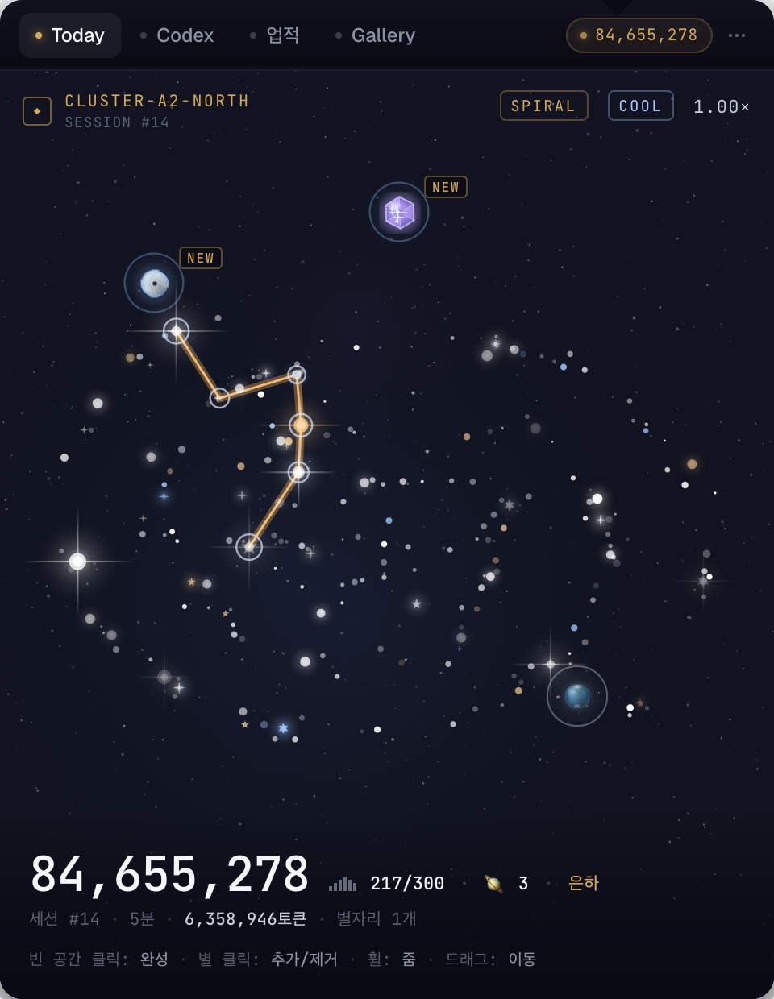
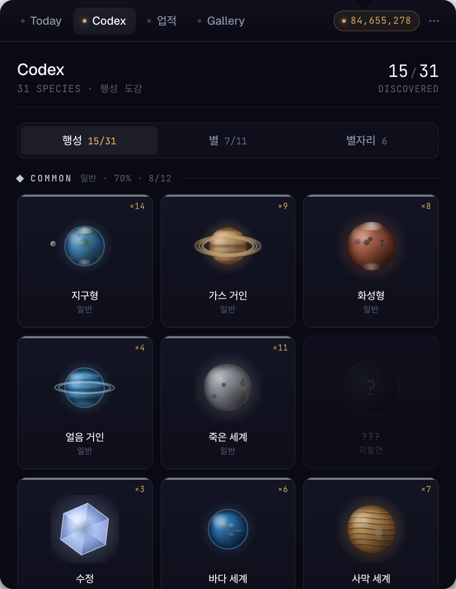
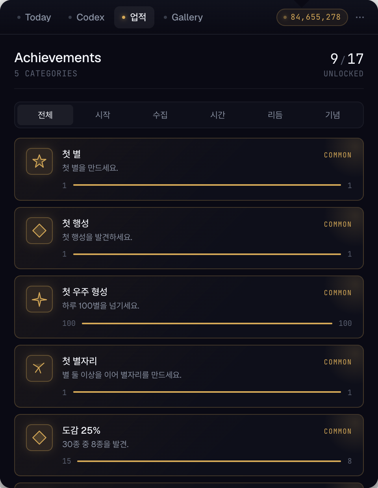
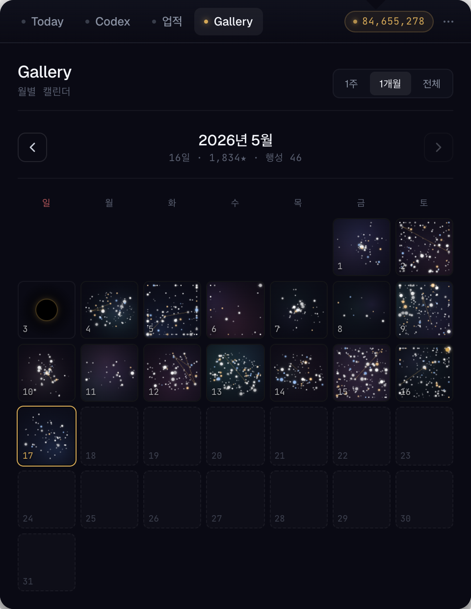
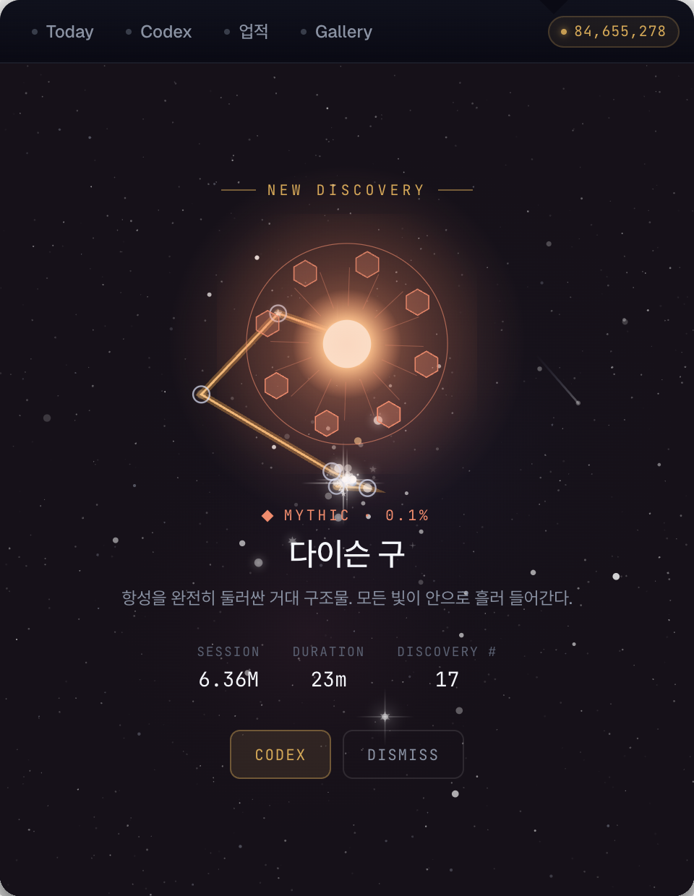
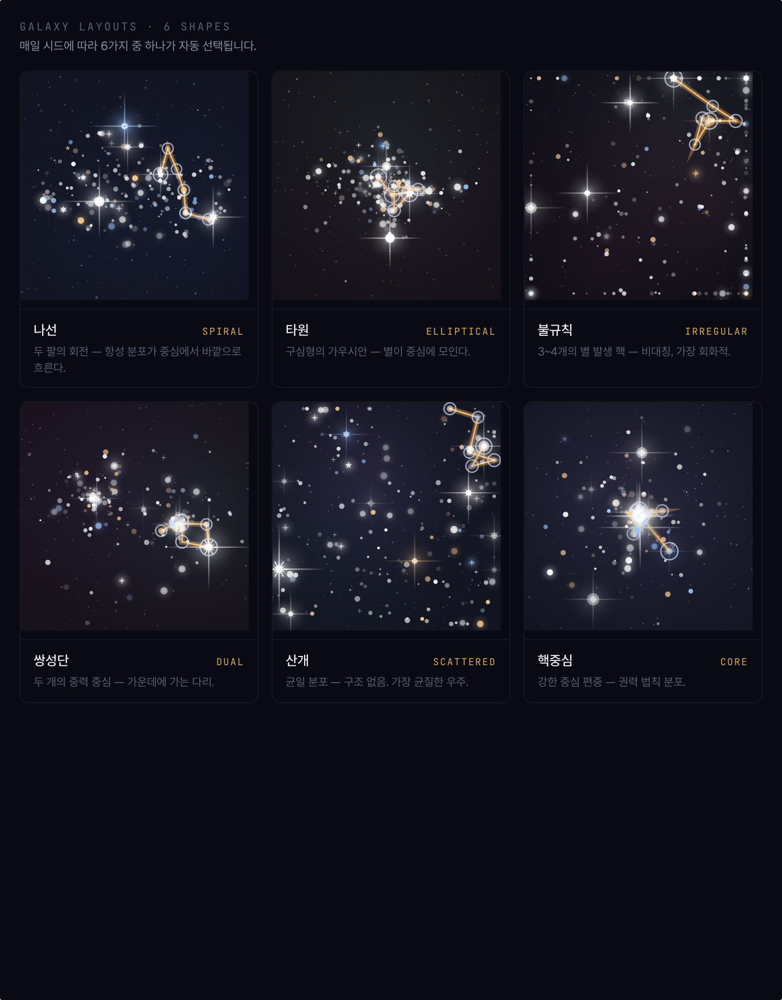

<div align="center">

[🇰🇷 한국어](README.md) · 🇬🇧 English


# Tokenova

**A tray app that turns your AI coding token usage into a daily universe of stars and planets.**

[](https://github.com/jkapa0417/tokenova/releases)
[](LICENSE.md)
[](https://v2.tauri.app/)
[](#download)
[](#interface-language)

</div>

---

## What is it

A small tray/menubar app that quietly reads token logs left by **Claude Code · Codex CLI · OpenCode** and visualises each day's work as **one universe**.

- Start coding → stars appear.
- A heavy session reveals a planet.
- Midnight closes the universe forever.
- The next day, a blank canvas opens again.

Tokenova doesn't ask you to change how you work. It just keeps a small universe at the edge of your screen, quietly recording your day in code.

---

## Core mechanics

| Event | Trigger | Result |
|---|---|---|
| ⭐ **Star** | Every 200,000 tokens | Daily star count goes up |
| 🪐 **Planet discovery** | A session closes with ≥1M tokens after 5 min idle, **or** an active session crosses every 20M tokens | Weighted roll for rarity (Common 70% / Rare 20% / Epic 8% / Legendary 1.9% / Mythic 0.1%) |
| 🌌 **Galaxy tier** | Total daily stars | Black Hole (0) · Nebula (1–30) · Cluster (31–100) · Galaxy (101–300) · Mega Galaxy (301–999) · Supercluster (1000+) |
| ✨ **Constellation** | You connect 2+ stars manually | Saved to codex permanently, rename-able |
| 💤 **Sleeping universe** | A day with almost no tokens | Calm landscape instead of stars + an achievement |

Sessions auto-close after **5 minutes idle**. A session that crosses 1M tokens triggers a planet roll on close; an active session triggers one extra roll every 20M tokens it accumulates. Daily cap is 10 planets (Mythic excluded).

---

## Features

- **🪐 30-planet Codex** — Common 12 / Rare 10 / Epic 5 / Legendary 2 / Mythic 1 (Black Hole). Discovery count + first/last seen tracked.
- **⭐ 14-star shape codex** — Round · Diamond · Pentagon · Hexagram · Heptagon · Octagram · Starburst · Binary · Ringed · Pulsar · Comet · Inner Galaxy · Cross · Spiral.
- **🏆 18 achievements** — First star, Codex 25%/50%/100%, First Rare/Legendary/Mythic, 7/30/100/365-day streaks, Sleeping Universe day, Mega Galaxy, and more.
- **📅 365-day Gallery** — Week / month / year heatmap. Past universes replay as live canvases (zoom + drag).
- **🎨 Constellation drawing** — Click stars to connect them on Today, give them a Korean/English/any name. Saved as a mini canvas in the codex, can be toggled as an overlay on the parent galaxy.
- **🔭 Planet discovery overlay** — Mythic finds get a fullscreen moment with a rotating SVG, rarity label and NEW badge.
- **🔔 Tray notifications** — Mythic / Legendary / Epic / Rare discoveries, 100-star galaxy formation, achievements, midnight close-out.
- **🌐 KO / EN interface** — Toggle in Settings, applies instantly. 30 planet names, 14 star shapes, every UI string is localised both ways.
- **🔄 Auto-update** — minisign-signed GitHub Releases manifest. New versions surface in an in-app banner.
- **🪟 OS-friendly tray icons** — Monochrome template on macOS (auto-tinted for light/dark menubars), full-colour planet+gold-ring on Windows/Linux. A gold dot appears when an unread discovery is queued.

---

## Interface preview

Four tabs in the same 480 × 620 tray popover.

| Today · today's universe | Codex · 30-species atlas |
|:---:|:---:|
|  |  |
| **Achievements** | **Gallery · 365-day collection** |
|  |  |

A Mythic discovery (0.1 % of all spawns) — a full-screen overlay slides in over the active tab.

<p></p>

Six galaxy layouts — the seed picks one each day. The same seed always renders the same shape.

<p></p>

The brand mark across tab / tray / Dock:

| | macOS menubar | Windows / Linux tray | Discovery indicator |
|---|:---:|:---:|:---:|
| |  |  |  |
| Behaviour | System auto-tints | Full colour | Gold dot attached |

> Captures above are exports from the design canvas in [`docs/assets/`](docs/assets/). The shipped app implements the same visual system but renders a different star/planet layout each day, seeded per user.

---

## Provider support

| Provider | Default path | Mechanism |
|---|---|---|
| **Claude Code** | `~/.claude/projects/` | JSONL filesystem watcher |
| **Codex CLI** | `~/.codex/sessions/YYYY/MM/DD/` | JSONL filesystem watcher |
| **OpenCode** | `~/.local/share/opencode/opencode.db` (Linux · macOS) / `%APPDATA%\opencode\opencode.db` (Windows) | SQLite, 5 s polling |

Custom paths are configurable in **Settings → LLM Providers**. OpenCode also honours the `OPENCODE_DATA_DIR` environment variable.

---

## Download

Grab installers from the GitHub Releases page:

👉 **[Latest release](https://github.com/jkapa0417/tokenova/releases/latest)**

| OS | File |
|---|---|
| **macOS** (Intel + Apple Silicon) | `Tokenova_<version>_universal.dmg` |
| **Windows** (x64) | `Tokenova_<version>_x64-setup.exe` |
| **Linux** (x64) | `tokenova_<version>_amd64.AppImage` · `tokenova_<version>_amd64.deb` |

> Once installed, the in-app auto-updater notices new versions and shows a banner.

### macOS first run

The DMG ships without Apple code signing, so Gatekeeper blocks the first launch. One-time workaround:

1. Open the DMG, drag `Tokenova.app` to `/Applications/`.
2. **Right-click → Open** (or `xattr -dr com.apple.quarantine /Applications/Tokenova.app`).
3. Click **Open** in the "unidentified developer" dialog.

After this, a small planet icon shows up in the menubar. Left-click toggles the popover, right-click opens the menu.

### Windows first run

SmartScreen may say "Windows protected your PC" — click **More info → Run anyway**.

### Linux (heads-up for GNOME)

GNOME hides the system tray by default. Install the AppIndicator extension to make the icon appear:

```bash
sudo apt install gnome-shell-extension-appindicator
gnome-extensions enable ubuntu-appindicators@ubuntu.com
```

KDE Plasma · XFCE · Cinnamon · MATE work without setup.

---

## How it works (brief)

```
┌──────────────┐    watch / poll       ┌─────────────┐
│ Provider logs │ ────────────────→   │   Watcher   │
│ (JSONL / DB)  │                     │   (Rust)    │
└──────────────┘                     └──────┬──────┘
                                            │ TokenEvent
                                            ↓
                                  ┌──────────────┐
                                  │   SQLite     │
                                  │ (single DB)  │
                                  └──────┬───────┘
                                         │
                          ┌──────────────┼──────────────┐
                          ↓              ↓              ↓
                  ┌──────────────┐ ┌──────────┐ ┌────────────┐
                  │   Engine     │ │ Session  │ │ Notifier   │
                  │ (stars/      │ │  Mgr     │ │ (OS toast) │
                  │  planets/    │ │          │ │            │
                  │  achievements│ └─────┬────┘ └────────────┘
                  └──────┬───────┘       │
                         │ Tauri event   │
                         ↓               ↓
                  ┌─────────────────────────────────┐
                  │  Frontend (Vanilla TS + Canvas)  │
                  │   Today · Codex · Gallery · Set  │
                  └─────────────────────────────────┘
```

- **Logs never leave your machine.** Everything runs locally; token data lives in a SQLite file under the OS user directory.
- **Universes are seed-deterministic.** The same date produces the same universe seed → same layout, palette, cluster name.
- **Midnight rollover is triple-safe.** A dedicated timer + lazy refresh on token events + lazy refresh on the frontend's 3-second poll. Even if the laptop slept across midnight, the new universe opens the moment it wakes up.

---

## Build from source

### Prerequisites

- **Rust 1.95+** (`rustup install stable`)
- **Node.js 20+**
- **macOS**: Xcode CLT (`xcode-select --install`)
- **Windows**: Microsoft Edge WebView2 (typically preinstalled), Visual Studio C++ Build Tools
- **Linux**:
  ```bash
  sudo apt install libgtk-3-dev libwebkit2gtk-4.1-dev \
                   libayatana-appindicator3-dev librsvg2-dev \
                   libssl-dev fonts-noto-cjk libnotify-bin
  ```

### Dev mode

```bash
git clone https://github.com/jkapa0417/tokenova
cd tokenova
npm install
npm run tauri dev
```

Debug builds show the popover as a decorated, always-visible window so you can develop without a tray. Also, the E2E HTTP console (`dev-console/`) is **debug-only** — release bundles strip it out entirely.

### Release build

```bash
npm run tauri build
```

Platform-specific artifacts land in `src-tauri/target/release/bundle/`.

### Enabling auto-update on a fork

Generate a new minisign keypair. Put the public key into `src-tauri/tauri.conf.json`'s `plugins.updater.pubkey`, and the private key into the GitHub Actions Secret `TAURI_SIGNING_PRIVATE_KEY`.

```bash
npx tauri signer generate -w ~/.tauri/your-key.key -p ""
cat ~/.tauri/your-key.key.pub   # → tauri.conf.json
cat ~/.tauri/your-key.key       # → GitHub Repo Secrets
```

Push a tag `v*` (or a prerelease `v*-rc.N`). `.github/workflows/release.yml` builds + signs + publishes on three OSes.

---

## Interface language

Tokenova ships in Korean and English. Switch in **Settings → 언어 / Language** — applies instantly to:

- UI labels · headers · HUD · tooltips
- 30 planet names + descriptions
- 14 star shape names + descriptions
- 18 achievement names + descriptions
- 6 galaxy tier names
- OS tray notifications (the Rust backend is locale-aware too)

Detection priority: *saved setting → system locale → Korean*. User-entered names for constellations and galaxies stay as typed — Korean, English, or any other language.

---

## Design references

- Build plan + visual simulations: [`docs/references/`](docs/references/)
- Key design overrides: [`docs/references/00-design-modifications.md`](docs/references/00-design-modifications.md)
- Palette: deep-space navy + Tokenova gold (`#d4a857`)
- Type: **Geist** (sans, UI), **JetBrains Mono** (mono, numerics / HUD)

---

## Roadmap

- [x] **v0.1.0** · First public release — Mac DMG · Windows EXE · Linux AppImage/deb · auto-update · KO/EN
- [ ] **v0.2.0** · Side ideas
  - Weekly digest (export PNG · share)
  - More providers (Cursor · Gemini Code · etc.)
  - Time-of-day rhythm achievements (Night Owl · Early Bird)
- [ ] **v1.0.0** · macOS Developer ID + Windows EV code signing, Sponsor switched on
- [ ] **v1.x+** · Long-term vision (see [docs/vision.en.md](docs/vision.en.md))
  - 🌐 **Opt-in community**: gallery to share your constellations/universes, anonymous stats comparison, developer coffee-chat space
  - 🍂 **Seasonal cosmetics**: spring / Halloween / winter / cyberpunk visual themes — no impact on current-build core features

The long-term direction and current-build principles are outlined in [the vision doc](docs/vision.en.md).

---

## License

**[FSL-1.1-ALv2](LICENSE.md)** — Functional Source License with Apache 2.0 Future License.

| Allowed | Restricted |
|---|---|
| ✅ Personal · internal · non-commercial education / research | ❌ Shipping a competing commercial product (for 2 years) |
| ✅ Modify · fork · study | |
| ✅ **Auto-converts to Apache 2.0 after 2 years** (forever) | |

See [LICENSE.md](LICENSE.md) for the full text.

---

## Contributing

Started as a personal side project — bug reports and small PRs are welcome.

- Bugs & ideas: [Issues](https://github.com/jkapa0417/tokenova/issues)
- For larger features, please open an issue first to discuss.

## Sponsor

If you enjoy this project, you'll soon be able to support it via [GitHub Sponsors](https://github.com/sponsors/jkapa0417) (page coming online).

---

<div align="center">

> Crafted by **junki.ahn**
> Made in Seoul, late at night ☕

</div>
