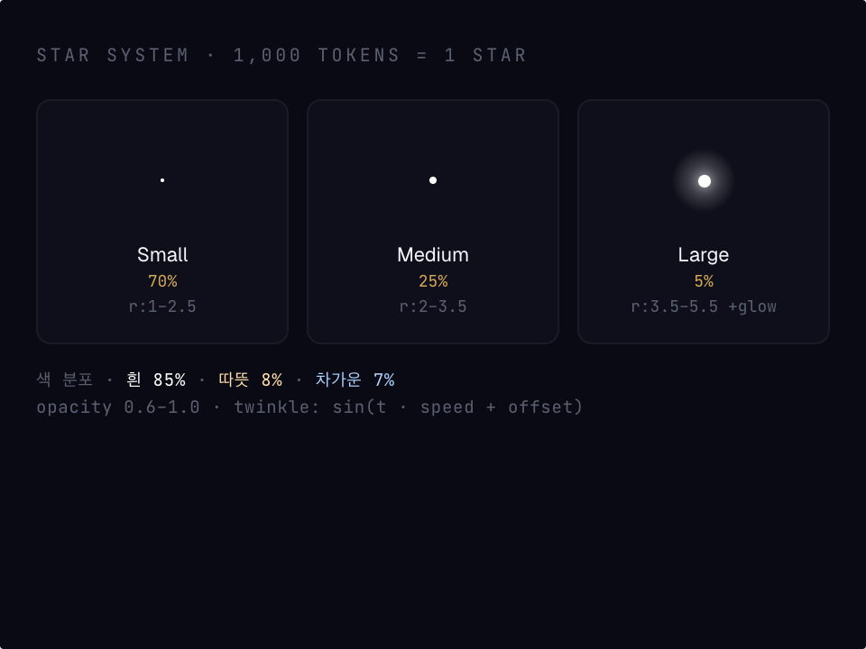
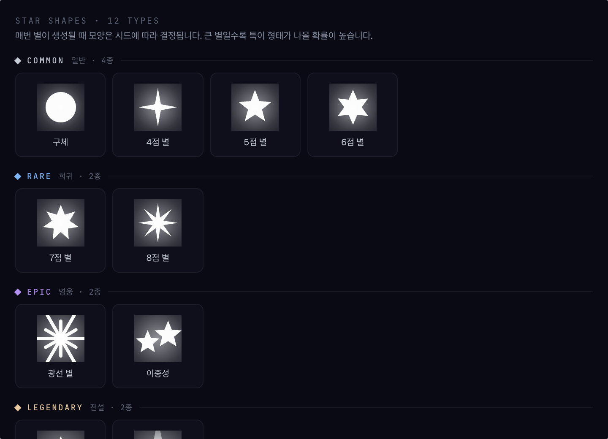
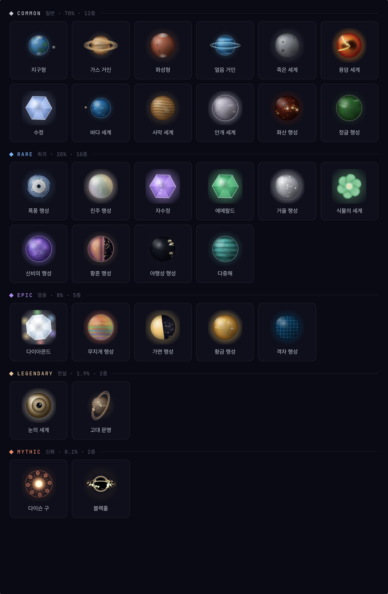
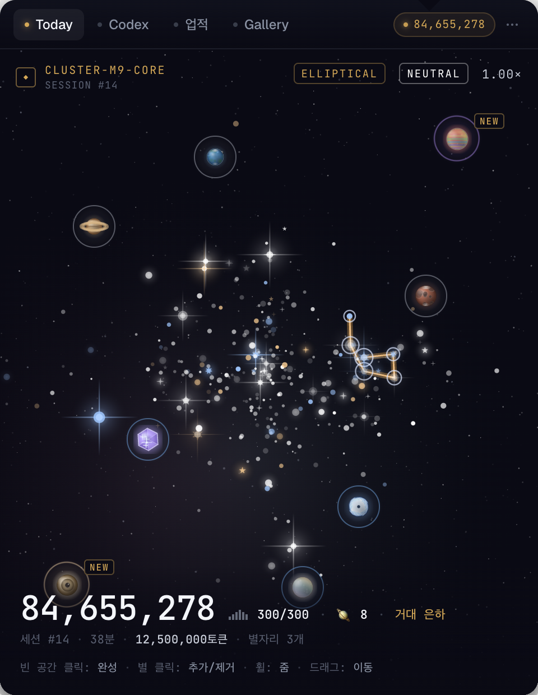
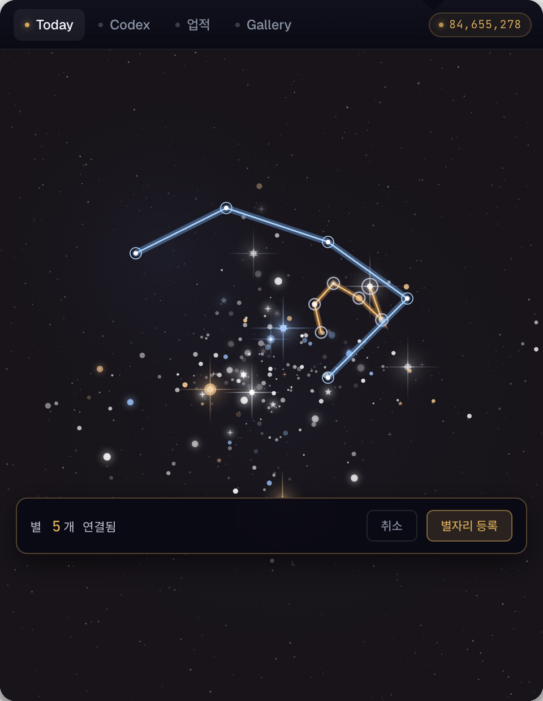
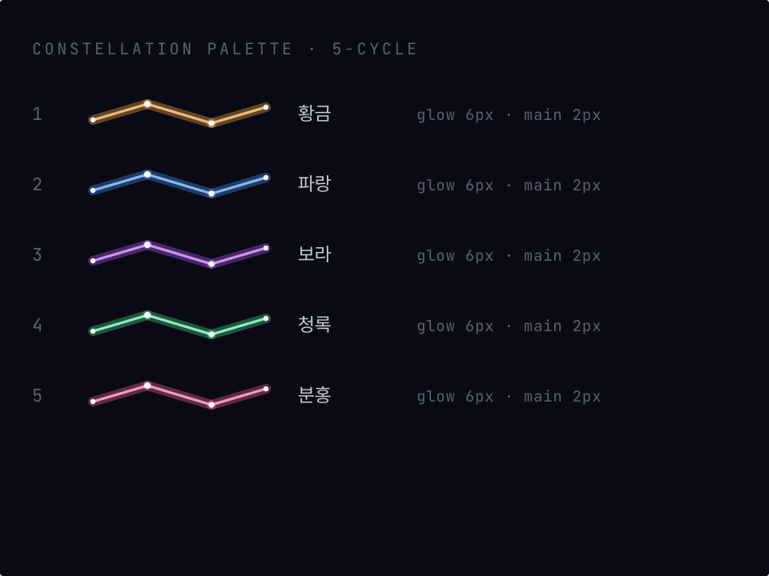
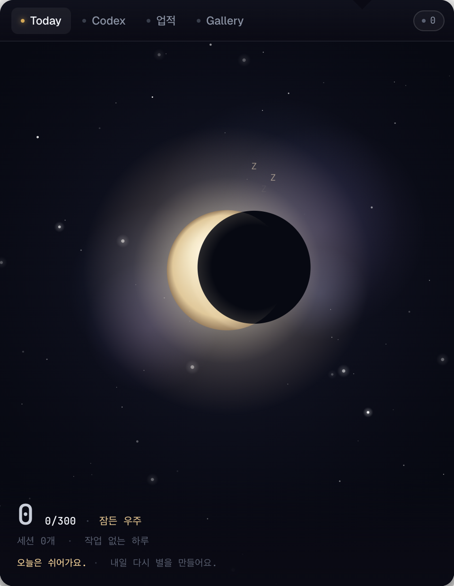

🇰🇷 한국어 · [🇬🇧 English](game-mechanics.en.md)

# Game Mechanics

Tokenova의 모든 수치 + 트리거 조건. 코드 상수가 항상 진실 — 이 문서는 *현재 시점* 스냅샷.

## 별 (Star)

<p></p>

별은 모양 12종으로 추첨됩니다. 큰 별일수록 특이형 (Diamond · Binary · Comet · …) 확률이 높습니다.

<p></p>

```
TOKENS_PER_STAR = 200_000       (src-tauri/src/engine/types.rs)
```

- 누적 토큰이 200,000을 넘을 때마다 별 1개가 추가됩니다.
- 잉여(leftover) 토큰은 그 날 내에 다음 별까지 누적. 자정 롤오버 시 reset.
- 첫 별은 별도로 "첫 별" 업적 트리거.
- 별의 좌표는 `(universe_seed, star_index)`로 결정 → 같은 별 인덱스는 매일 다른 위치 (조밀해 보이지 않게 jitter).

## 행성 (Planet)

31종 행성 카탈로그. 등급별 빈도는 아래 룰렛 표 참조.

<p></p>

Mythic 발견 순간은 풀스크린 오버레이로 처리됩니다:

<p></p>

```
PLANET_SESSION_THRESHOLD = 1_000_000      (engine/types.rs)
FORCED_PLANET_TOKEN_THRESHOLD = 20_000_000 (session.rs)
IDLE_TIMEOUT_SECS = 5 * 60                (session.rs)
DAILY_PLANET_CAP = 10                     (engine/types.rs, Mythic 제외)
```

### 트리거 두 가지

1. **Idle close 후 ≥1M 토큰** — 5분간 새 이벤트가 없으면 세션이 자동 종료. 해당 세션의 총 토큰이 1M 이상이면 행성 발견 시도.
2. **활성 세션이 누적 20M 토큰** — 세션을 끊지 않은 채 한 번에 20M씩 쌓을 때마다 강제 트리거. 50M 세션이면 (20M·40M에서 2발) + idle close 시 residual 10M ≥1M (1발) = 총 3발.

`residual` 계산: `total_tokens − triggered_chunks × 20M`. 1M 이상 남았을 때만 idle close 시 추가 트리거.

### 등급 룰렛

```
Common     70.0 %
Rare       20.0 %
Epic        8.0 %
Legendary   1.9 %
Mythic      0.1 %
```

(`src-tauri/src/engine/catalog.rs`의 `*_WEIGHT` 상수)

룰렛은 PCG32 RNG, seed = `mix(universe_seed, session_id, total_tokens)`. 같은 트리거는 같은 결과를 재현.

### 종 (Species) 분포

| 등급 | 종 수 | 종 예시 |
|---|---|---|
| Common | 12 | Earth-like · Gas Giant · Martian · Ice Giant · Dead World · Lava World · Crystal · Ocean World · Desert · Mist · Volcanic · Jungle |
| Rare | 10 | Storm · Pearl · Amethyst · Emerald · Mirror · Botanical · Mystic · Twilight · Nocturnal · Multi-ocean |
| Epic | 5 | Diamond · Rainbow · Mask · Golden · Grid |
| Legendary | 2 | Eye World · Ancient Civilisation |
| Mythic | 2 | Dyson Sphere · Black Hole |

행성 한 개를 발견하면 그 안에서 종은 uniform 추첨. **총 30종 = 12+10+5+2+2 (정확함)**.

### 일일 캡

- 하루 행성 10개까지. 11개째 시도는 `CapReached`로 skip.
- **Mythic은 캡과 무관하게 트리거.** 따라서 10개 채우고도 Mythic은 따로 나옴.

### 배치 규칙

- `find_empty_position` — 최대 200 attempt
- 다른 행성과 최소 90 world unit 간격 (이미지 약 76 unit, 안전 buffer 14)
- 별과 최소 18 world unit 간격
- world edge 120 unit 안쪽
- 하단 HUD 영역 (Today HUD 위) 260 unit 잘라냄
- 모든 조건 만족 못 하면 `best_with_gap` (별 간격 무시) → `roomiest` (조밀한 우주의 fallback) → 마지막엔 random

## 은하 등급 (Galaxy Type)

레이아웃은 6종 중 하나가 매일 시드로 선택됩니다 — `spiral · elliptical · irregular · dual_cluster · scattered · core_heavy`.

<p></p>

별 300개 이상이면 그 날의 우주는 Mega Galaxy. 행성 발견 캡 직전의 캔버스는 이런 모습:

<p></p>

자정 마감 시 그 날의 별 개수로 분류.

```
별 수             등급
0                Black Hole       (잠든 우주)
1 – 30           Nebula           (성운)
31 – 100         Cluster          (별무리)
101 – 300        Galaxy           (은하)
301 – 999        Mega Galaxy      (거대 은하)
1000+            Supercluster     (초은하단)
```

(`engine/types.rs::GalaxyType::classify`)

100을 넘는 순간 트레이 알림 "은하 형성" 발사.

## 별자리 (Constellation)

별을 클릭으로 이어 그리는 모드에선 하단에 액션바가 뜹니다. 등록 시점에 색상은 5종 팔레트 순환 사용.

<p>
  
  
</p>

- 사용자가 Today에서 별 클릭으로 연결. 최소 2개부터 등록 가능.
- 이름: 비워두면 결정적 자동 생성 (`adjective + subject + 자리/Constellation`).
  - 한국어 풀: `사슴/곰/용/학/...` × `빛나는/잠든/날아가는/...`
  - 영어 풀: `Stag/Bear/Dragon/Crane/...` × `Radiant/Sleeping/Soaring/...`
- 코덱스의 별자리 서브탭에 mini canvas로 저장. 자기 은하 위에 오버레이로 보이게도 가능.

## 업적 (Achievement)

총 18개. 각 키와 트리거:

| 키 | 카테고리 | 트리거 |
|---|---|---|
| `first_star` | starter | 첫 별 첫 추가 시 |
| `first_planet` | starter | 첫 행성 첫 발견 시 |
| `first_universe` | starter | 별 100개 첫 도달 시 (= Galaxy 등급) |
| `first_constellation` | starter | 첫 별자리 저장 시 |
| `codex_quarter` | collection | 도감 8종 발견 |
| `codex_half` | collection | 도감 15종 발견 |
| `codex_complete` | collection | 도감 30종 모두 발견 |
| `first_rare_planet` | collection | 첫 Rare 등급 이상 발견 |
| `first_legendary_planet` | collection | 첫 Legendary 발견 |
| `first_mythic_planet` | collection | 첫 Mythic 발견 |
| `first_black_hole` | time | 첫 잠든 우주의 날 (= 토큰 0인 날 마감) |
| `first_mega_galaxy` | time | 첫 Mega Galaxy / Supercluster 마감 |
| `night_owl` | rhythm | 자정~04시 누적 10시간 (엔진 미구현, 예약) |
| `early_bird` | rhythm | 05시~08시 누적 10시간 (엔진 미구현, 예약) |
| `streak_7` | anniversary | 7일 연속 우주 형성 |
| `streak_30` | anniversary | 30일 연속 |
| `streak_100` | anniversary | 100일 연속 |
| `streak_365` | anniversary | 365일 연속 |

(`src-tauri/src/engine/achievements.rs`)

각 업적은 한 번만 기록 (idempotent insert). 달성 시 OS 트레이 알림 + 인앱 emit.

## 쉬어가는 날 (잠든 우주)

토큰이 0으로 마감되면 별 캔버스 대신 부드러운 달 + 별 풍경으로 대체됩니다. `잠든 우주` 업적 (`first_black_hole`) 이 따라옵니다.

<p></p>

## 자정 롤오버

- 사용자의 로컬 시간대 자정 기준.
- 전날 universe의 `galaxy_type`을 stamp + `finalized_at` 기록.
- 새 날 universe row 자동 생성.
- 토큰 카운터 + leftover + (그 날의) star_count 0으로 초기화.
- 별 + 행성 + 별자리는 그 날짜의 universe row에 영구 보존 → Gallery에서 재현.

## 알림 정책

```
Off       알림 없음
Standard  Rare 이상 행성 / 업적 / 100별 / 은하 마감만
Verbose   Common 행성도 포함
DAILY_CAP = 5
```

(`src-tauri/src/notifier.rs`)

현재 빌드는 Standard 고정. 일일 5회 cap을 넘으면 그 날 추가 알림 silent. 자정에 reset.
